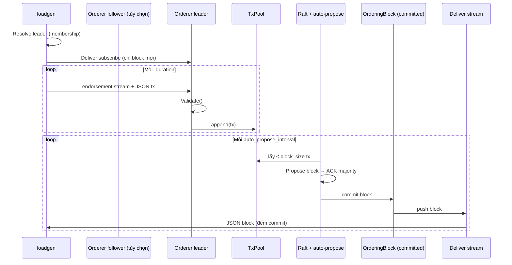
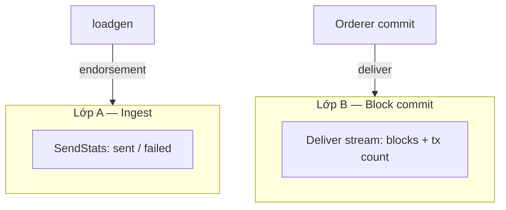

# Loadgen — Hướng dẫn chi tiết

Tài liệu mô tả **luồng transaction**, **cách đo tốc độ đóng block** trên Ordering Service, và **ảnh hưởng từng tham số** của `loadgen`.

Tài liệu quick-start ngắn: [ORDERER_LOADGEN.md](./ORDERER_LOADGEN.md).

---

## 1. Loadgen là gì?

`loadgen` (`orderingservice/source/cmd/loadgen`) là công cụ benchmark gửi **hàng loạt smart-contract transaction** trực tiếp tới Ordering Service qua libp2p, **không** qua Core Service (WASM) hay Commit Peer (ký endorsement).

Mục đích:

- Đo **khả năng ordering thuần** — TxPool, auto-propose, Raft commit.
- So sánh **tốc độ gửi (ingest)** vs **tốc độ đóng block (commit)**.

Build:

```bash
cd orderingservice/source
go build -o loadgen.exe ./cmd/loadgen
```

---

## 2. Luồng transaction, loadgen và orderer

### 2.1 Tổng quan



### 2.2 Giai đoạn 1 — Loadgen khởi tạo

| Bước | Mô tả |
|------|--------|
| Tạo libp2p host | Port ngẫu nhiên trên máy chạy loadgen |
| `-orderer` | Connect tới **bất kỳ** node cluster (follower hoặc leader) |
| Resolve leader | Gửi `MsgMembershipRequest` → nhận `leader_id` + địa chỉ dial |
| Deliver subscribe | Mở stream `/raft-order-service/deliver/1.0.0`, `FromIndex` rất lớn → **chỉ block commit sau thời điểm subscribe** |

Deliver chạy **song song** với gửi tx — dùng để đo block commit, không ảnh hưởng gửi.

### 2.3 Giai đoạn 2 — Gửi transaction (ingest)

Mỗi transaction loadgen tạo là **smart-contract tx giả lập**:

```json
{
  "txid": "loadgen-42-1718000000000",
  "version": 1,
  "locktime": 0,
  "client_pubkey": "<64 hex chars>",
  "contract_name": "bench_ping",
  "function_name": "execute",
  "payload": "<hex của {\"v\":\"...\"}>",
  "vin": [],
  "vout": []
}
```

Gửi qua protocol **`/raft-order-service/endorsement/1.0.0`** — **cùng đường** Core Service dùng sau khi Commit Peer ký.

Trên orderer (`HandleEndorsementStream`):

1. Decode JSON → `types.Transaction`
2. `Validate()` — cần `txid`, `contract_name`, `function_name`, `payload`, `client_pubkey`; **không** verify chữ ký
3. Nếu node là **follower** → forward sang leader qua endorsement
4. **Leader** → `SubmitTransaction` → **append TxPool**

TxPool là buffer **in-memory** trên leader (`[]Transaction`), mutex-protected. Restart node = mất pool.

### 2.4 Giai đoạn 3 — Đóng block trên orderer

Chỉ **leader** chạy vòng **auto-propose** (khi đã trở thành leader):

| Tham số mặc định (`cmd/server`) | Giá trị | Ý nghĩa |
|-----------------------------------|---------|---------|
| `auto_propose_block_size` | 1000 | Tối đa tx lấy từ TxPool mỗi block |
| `auto_propose_interval_ms` | 100 | Tick kiểm tra TxPool mỗi 100ms |

Luồng mỗi tick (có tx trong pool):

1. Lấy tối đa `block_size` tx **đầu** TxPool
2. Tạo `Block` (hash chain, Merkle root)
3. Broadcast `MsgBlockProposal` → chờ majority ACK (Raft)
4. `commitBlock` → append **OrderingBlock**, xóa tx đã commit khỏi TxPool
5. `DeliverMgr.NotifyNewBlock` → push block tới mọi subscriber deliver (gồm loadgen)

Trần lý thuyết commit:

```
tx/s max  ≈ block_size / (interval_ms / 1000)  ≈ 1000 / 0.1 = 10.000 tx/s
blocks/s  ≈ 10 block/s
```

Thực tế thấp hơn do Raft ACK, 2+ node, tải CPU/mạng.

### 2.5 So với luồng production (Core → Orderer)

| | loadgen | Core Service |
|--|---------|--------------|
| Protocol vào orderer | endorsement | endorsement (giống) |
| WASM / contract thật | Không | Có |
| Chữ ký Commit Peer | Không | Có |
| Vào TxPool | Giống | Giống |
| Đóng block | Giống | Giống |

Loadgen đo **ordering thuần**; số production thường thấp hơn do bottleneck Core/Commit Peer.

---

## 3. Cách loadgen đo tốc độ

Loadgen đo **hai lớp độc lập**:



### 3.1 Lớp A — Tốc độ gửi (ingest)

| Metric | Công thức | Cửa sổ thời gian |
|--------|-----------|------------------|
| `sent` | Số tx gửi endorsement thành công | — |
| `failed` | Lỗi tạo tx / connect / stream | — |
| `Send rate` | `sent / (loadEnd - loadStart)` | Chỉ **`-duration`** |

**Drain không tính** vào send rate. Trong drain không gửi thêm tx.

Ý nghĩa: orderer **nhận** bao nhiêu tx/s vào TxPool (hoặc forward tới leader).

### 3.2 Lớp B — Tốc độ đóng block (commit) — metric chính

Loadgen subscribe **deliver stream** tới leader. Mỗi block commit → orderer encode `types.Block` → loadgen đếm `len(transactions)`.

| Metric trong summary | Công thức | Cửa sổ |
|----------------------|-----------|--------|
| **During load** — `blocks/s`, `tx/s` | block & tx commit trong `[loadStart, loadEnd]` | `-duration` |
| **Avg tx/block (load)** | `tx / blocks` trong load window | `-duration` |
| **Load + drain** | block & tx trong `[loadStart, drainEnd]` | duration + `-drain` |
| **Peak span** | tx & block / `(lastCommit - firstCommit)` | Từ commit đầu → commit cuối |

**Số nên dùng cho báo cáo thesis:** dòng **During load** — phản ánh orderer đóng bao nhiêu block/tx **trong lúc** đang bắn tx.

**Load + drain** hữu ích khi send > commit: backlog commit tiếp sau khi ngừng gửi.

### 3.3 Log tiến trình (mỗi `-progress`)

```
[loadgen] sent=49500 failed=0 commit_tx=48000 commit_sustained=4800 tx/s commit_instant=5200 tx/s
```

| Field | Ý nghĩa |
|-------|---------|
| `commit_tx` | Tổng tx đã commit (tích lũy từ đầu run) |
| `commit_sustained` | `commit_tx trong [loadStart, now] / elapsed` |
| `commit_instant` | Delta commit / khoảng `-progress` (ước lượng tức thời) |

### 3.4 Đọc kết quả — ví dụ

```
--- Ingest (loadgen send) ---
Sent: 49644  Failed: 0  Send rate: 4961.2 tx/s

--- Orderer block commit (deliver) ---
During load (10.0s):  98 blocks, 98000 tx  →  9.80 blocks/s, 9800.0 tx/s
Avg tx/block (load):   1000.0
```

| So sánh | Diễn giải |
|---------|------------|
| Send ≈ Commit | Orderer xử lý kịp |
| Send >> Commit | TxPool backlog — ingest nhanh hơn đóng block |
| Commit ~10k tx/s | Gần trần mặc định (1000 tx × 10 block/s) |
| `failed` > 0 | Lỗi gửi — giảm `-tps` hoặc `-workers` |

### 3.5 Cách đo thủ công (không cần loadgen summary)

Trên leader (`cmd/server` → lệnh `status`):

- **Tx Pool (pending)** — backlog
- **Ordering Blocks (committed)** — tổng block đã commit

Log leader: `Committing block ... with N tx`, `Block ... committed`.

### 3.6 Tùy chọn `-ws` (orchestrator)

Nếu chạy **orchestrator**, có thể bật `-ws ws://host:8080/ws/events` để nhận event `block-committed`. **Không bật cùng deliver** (dễ đếm trùng). Với `cmd/server`: mặc định `-ws ""`, chỉ dùng deliver.

---

## 4. Tham số loadgen và ảnh hưởng

### 4.1 Bảng tổng hợp

| Flag | Mặc định | Ảnh hưởng chính |
|------|----------|-----------------|
| `-orderer` | (bắt buộc) | Bootstrap membership; resolve leader |
| `-tps` | `5000` | Target tx/s **gửi**; `0` = unlimited |
| `-duration` | `30s` | Thời gian bắn tx; cửa sổ **During load** commit |
| `-drain` | `15s` | Chờ commit backlog; cửa sổ **Load + drain** |
| `-workers` | `16` | Song song gửi stream; ảnh hưởng max send |
| `-prefix` | `loadgen-` | Tiền tố `txid` (lọc log/SQL) |
| `-contract` | `bench_ping` | Field `contract_name` |
| `-function` | `execute` | Field `function_name` |
| `-client-pubkey` | key test | Field `client_pubkey` (bắt buộc validate) |
| `-ws` | `""` | WS orchestrator (tùy chọn) |
| `-progress` | `5s` | Chu kỳ log tiến trình |

---

### 4.2 `-orderer`

**Multiaddr libp2p** của bất kỳ node trong cluster:

```
/ip4/<host>/tcp/<port>/p2p/<PeerID>
```

| Ảnh hưởng | Chi tiết |
|-----------|----------|
| Sai PeerID/port | `failed` cao hoặc lỗi resolve leader |
| Trỏ follower | OK — loadgen tự tìm leader và gửi tới leader |
| Mạng | Loadgen phải reach được IP:port của leader (thường port leader khác follower) |

Lấy địa chỉ từ output khi start `cmd/server`: dòng `Address: ...`.

---

### 4.3 `-tps`

Target số transaction **enqueue mỗi giây** (lớp A).

Cơ chế: 10 tick/s, mỗi tick đẩy `tps/10` job vào queue (tối thiểu 1 job/tick).

| Giá trị | Hiệu ứng |
|---------|----------|
| Thấp (1k–5k) | Dễ đạt target; commit thường theo kịp |
| ~10k | Gần trần commit mặc định orderer |
| Rất cao (50k+) | Send thực tế **bão hòa** (~8–20k tùy workers/mạng); không tăng commit |
| `0` | Gửi tối đa — chỉ để stress, khó so sánh |

**Không** đặt `-tps` cao hơn commit thực nếu mục tiêu đo **sustained block rate** ổn định — chỉ làm TxPool phình.

---

### 4.4 `-duration`

Thời gian **duy nhất** loadgen gửi tx mới.

| Ảnh hưởng | Chi tiết |
|-----------|----------|
| Ngắn (5–10s) | Nhanh, có thể chưa ổn định (warm-up) |
| 30–60s | Phù hợp sustained metric |
| Dài | TxPool/orderer nóng; nên dùng `-prefix` riêng mỗi run |

```
Tổng tx mục tiêu ≈ tps × duration (giây)
```

**During load** commit metric dùng đúng khoảng này.

---

### 4.5 `-drain`

Thời gian **chờ sau** khi dừng gửi — không gửi tx mới.

| Ảnh hưởng | Chi tiết |
|-----------|----------|
| Không tính send rate | `sent` đứng yên |
| Có trong **Load + drain** commit | Block commit muộn vẫn được đếm |
| Quá ngắn | Under-count commit khi send > commit |
| 15–30s | Thường đủ khi backlog vài chục nghìn tx |

---

### 4.6 `-workers`

Số goroutine xử lý queue gửi. Mỗi tx = **1 libp2p stream** mới.

| Workers | Khi nào |
|---------|---------|
| 8–16 | `-tps` ≤ 10k, đủ trong hầu hết case |
| 32–48 | Send không đạt target, `failed=0` |
| > 64 | Thường không lợi; `failed` có thể tăng |

Quy tắc thô: `workers ≈ min(64, max(16, tps/500))`.

Workers cao **không** tăng commit block nếu orderer đã bão hòa — chỉ đẩy TxPool.

---

### 4.7 `-prefix`, `-contract`, `-function`, `-client-pubkey`

Chỉ ảnh hưởng **nội dung JSON tx**, không đổi protocol.

| Flag | Ảnh hưởng |
|------|------------|
| `-prefix` | Unique `txid`; lọc khi query DB/log |
| `-contract` / `-function` | Phải khớp validate smart-contract tx |
| `-client-pubkey` | Bắt buộc non-empty; không cần key thật |

Không cần deploy contract trên Core.

---

### 4.8 `-progress` và `-ws`

| Flag | Ảnh hưởng |
|------|------------|
| `-progress` | Tần suất log; không đổi kết quả cuối |
| `-ws` | Chỉ orchestrator; mặc định tắt; ưu tiên deliver |

---

## 5. Quy trình benchmark đề xuất

### 5.1 Chuẩn bị

1. Start orderer (`cmd/server`): node đầu `y` (leader), node sau join cluster.
2. Ghi multiaddr và đảm bảo loadgen reach được leader (port trong `→ Leader:`).
3. (Tùy chọn) `status` trên leader — TxPool ≈ 0 trước run.

### 5.2 Warm-up

```bash
loadgen.exe -orderer "..." -tps 2000 -duration 10s -prefix "warmup-"
```

Bỏ qua kết quả; đợi TxPool drain (~30s) hoặc `status`.

### 5.3 Steady-state

```bash
loadgen.exe -orderer "..." -tps 5000 -duration 60s -drain 30s -workers 32 -prefix "bench-run1-"
```

Ghi **During load**: `blocks/s`, `tx/s`, `avg tx/block`.

### 5.4 Tìm điểm bão hòa

Tăng dần `-tps`: 5k → 10k → 15k → 20k. Dừng khi:

- **Commit tx/s** không tăng thêm, hoặc
- **Send >> Commit** liên tục, TxPool tăng mãi trên `status`.

### 5.5 Checklist đọc kết quả

- [ ] `failed = 0` (hoặc rất nhỏ)
- [ ] **During load** `tx/s` — metric orderer chính
- [ ] **During load** `blocks/s`
- [ ] `avg tx/block` ≈ `auto_propose_block_size` khi pool đủ tx
- [ ] So sánh send rate vs commit tx/s

---

## 6. Xử lý sự cố

| Triệu chứng | Nguyên nhân thường gặp | Hướng xử lý |
|-------------|------------------------|-------------|
| `sent=0` | Bug cũ / build cũ | Build lại loadgen mới nhất |
| `During load: (no blocks)` | Deliver không kết nối / không phải leader | Kiểm tra leader, firewall |
| Send cao, commit thấp | Ingest > commit capacity | Giảm `-tps`; xem TxPool `status` |
| `failed` tăng | Quá nhiều workers / mạng | Giảm `-workers` hoặc `-tps` |
| Commit giảm sau nhiều run | TxPool backlog, orderer nóng | Nghỉ giữa các run; drain lâu hơn |
| Lần 2 cùng `-tps` chậm hơn lần 1 | Backlog từ run trước | Đợi drain; restart orderer nếu cần baseline sạch |

---

## 7. Liên kết mã nguồn

| Thành phần | File |
|------------|------|
| CLI | `source/cmd/loadgen/main.go` |
| Runner | `source/pkg/loadgen/runner.go` |
| Gửi tx | `source/pkg/loadgen/sender.go` |
| Đo commit (deliver) | `source/pkg/loadgen/deliver_watch.go` |
| Summary / metric | `source/pkg/loadgen/watcher.go` |
| Orderer endorsement | `source/internal/raft/endorsement.go` |
| TxPool + auto-propose | `source/internal/raft/transaction.go` |
| Deliver server | `source/internal/raft/deliver.go` |
