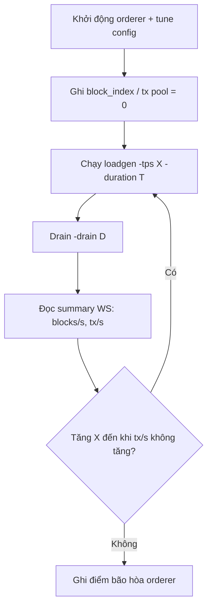

# Loadgen — benchmark thuần Ordering Service

> Hướng dẫn chi tiết (flow, đo tốc độ, tham số): **[LOADGEN_GUIDE.md](./LOADGEN_GUIDE.md)**

Tool gửi **smart-contract transaction** trực tiếp tới orderer qua libp2p protocol `/raft-order-service/endorsement/1.0.0` (cùng đường Core Service dùng), **không** qua WASM / Commit Peer.

---

## 1. Build

```bash
cd orderingservice/source
go build -o loadgen.exe ./cmd/loadgen
```

---

## 2. Chuẩn bị stack tối thiểu

| Thành phần | Bắt buộc | Ghi chú |
|------------|----------|---------|
| **Orderer** (orchestrator hoặc `cmd/server`) | Có | Leader auto-propose block |
| **Orchestrator UI** | Khuyến nghị | WebSocket `block-committed` để đo blocks/s |
| Postgres / Core / Commit peer | Không | Chỉ cần khi đo mirror ledger |

### Khởi động orderer (orchestrator)

```bash
cd orderingservice/source/web && npm install && npm run build
cd .. && go build -o orchestrator ./cmd/orchestrator
./orchestrator
# UI + API: http://localhost:8080
```

Tạo **ít nhất 1 node** (P2P port vd. `6000`). Ghi multiaddr:

```
/ip4/127.0.0.1/tcp/6000/p2p/12D3KooW...
```

### Tune auto-propose (tùy chọn)

```bash
curl -X PATCH http://localhost:8080/api/nodes/6000/config \
  -H "Content-Type: application/json" \
  -d '{"auto_propose_interval_ms": 100, "auto_propose_block_size": 1000}'
```

---

## 3. Chạy loadgen

```bash
./loadgen.exe \
  -orderer "/ip4/127.0.0.1/tcp/6000/p2p/12D3KooW..." \
  -tps 5000 \
  -duration 60s \
  -drain 30s \
  -workers 32 \
  -prefix "loadgen-bench-"
```

| Flag | Mặc định | Mô tả |
|------|----------|--------|
| `-orderer` | (bắt buộc) | Multiaddr bất kỳ node trong cluster |
| `-tps` | `5000` | Target tx/s (`0` = gửi tối đa) |
| `-duration` | `30s` | Thời gian bắn tx |
| `-drain` | `15s` | Chờ block commit sau khi dừng gửi |
| `-workers` | `16` | Goroutine gửi song song |
| `-prefix` | `loadgen-` | Prefix `txid` |
| `-contract` | `bench_ping` | `contract_name` |
| `-function` | `execute` | `function_name` |
| `-ws` | `ws://localhost:8080/ws/events` | Đo block commit realtime (để trống để tắt) |

---

## 4. Kế hoạch đo tốc độ đóng block

### 4.1 Ba lớp metric

| Lớp | Nguồn | Đo gì |
|-----|--------|--------|
| **A. Gửi (loadgen)** | stdout `sent=`, `failed=`, `Send rate` | Tx/s vào orderer (endorsement) |
| **B. Commit orderer (khuyến nghị)** | Orchestrator WS `block-committed` | **blocks/s**, **tx/s commit** thuần orderer |
| **C. Mirror ledger (tùy chọn)** | Commit peer + Postgres | Xác nhận end-to-end deliver (thêm độ trễ) |

### 4.2 Cách B — WebSocket orchestrator (tích hợp sẵn trong loadgen)

Loadgen subscribe `ws://localhost:8080/ws/events`, đếm event:

```json
{"type":"block-committed","data":{"port":6000,"blockIndex":42,"hash":"...","txCount":1000}}
```

Cuối run in summary:

- `Blocks committed (WS)` — tổng block trong cửa sổ commit
- `blocks/s` — `blocks / (last_commit - first_commit)`
- `tx/s` — `sum(txCount) / span`
- `Avg tx/block`

Log định kỳ: `commit_rate=... tx/s` (delta tx committed / 5s).

### 4.3 Cách B — Thủ công qua UI

1. Mở orchestrator → terminal node leader → lệnh `status`
2. Xem **Ordering Blocks (committed)** và **Tx Pool (pending)** trước/sau load
3. Hoặc theo dõi event **block-committed** trên UI timeline

### 4.4 Cách C — Postgres (khi có commit peer)

Chạy commit peer mirror, sau load:

```sql
SELECT date_trunc('second', COALESCE(ledger_committed_at, committed_at)) AS sec,
       COUNT(DISTINCT l.id) AS blocks,
       COUNT(lt.txid) AS txs
FROM commit_peer.ledger l
JOIN commit_peer.ledger_transactions lt ON lt.block_id = l.id
WHERE lt.txid LIKE 'loadgen-bench-%'
GROUP BY 1 ORDER BY 1 DESC LIMIT 30;
```

### 4.5 Công thức tham chiếu

```
tx/s sustained   = tổng tx commit / thời gian cửa sổ đo
blocks/s         = tổng block commit / thời gian cửa sổ đo
avg_tx_per_block = tx/s ÷ blocks/s
```

Trần lý thuyết (mặc định `1000 tx/block`, `100ms` interval):

```
tx/s max  ≈ 10.000
blocks/s  ≈ 10
```

### 4.6 Quy trình benchmark đề xuất



1. **Warm-up**: `-duration 10s -tps 1000` (bỏ qua kết quả)
2. **Steady**: `-tps 3000,5000,8000` × `60s`, ghi `commit_rate`
3. **Drain**: `-drain 30s` để block cuối được commit
4. **So sánh**: `sent rate` vs `commit tx/s` — chênh lớn = backlog TxPool

### 4.7 Phân biệt với k6 → Core

| | loadgen (doc này) | k6 → Core |
|--|-------------------|-----------|
| Đường vào orderer | libp2p endorsement trực tiếp | Core sau WASM + ký |
| Đo orderer thuần | Có (WS) | Commit qua Postgres (cả pipeline) |
| Giống production | Thấp hơn | Cao hơn |

---

## 5. Ví dụ output

```
→ Leader: /ip4/127.0.0.1/tcp/6000/p2p/12D3KooW...
→ Load: 5000 tx/s × 1m0s (32 workers) prefix=loadgen-bench- contract=bench_ping
[loadgen] sent=25000 failed=0 committed_tx=24800 commit_rate=4960 tx/s
...
========== ORDERER LOADGEN ==========
Load window: 2026-06-10T10:00:00Z → 2026-06-10T10:01:00Z (60.0s)
Sent:        300000  Failed: 12  Send rate: 5000.0 tx/s
Blocks committed (WS): 298  (4.95 blocks/s over commit span)
Tx committed (WS):     297500  (4958.3 tx/s over commit span)
Avg tx/block:          998.3
Drain wait: 30.0s after load
================================
```

---

## 6. Xử lý sự cố

| Triệu chứng | Nguyên nhân | Cách xử lý |
|-------------|-------------|------------|
| `Failed` cao | Sai multiaddr / orderer chưa leader | Kiểm tra orchestrator, đợi election |
| `committed_tx=0` | WS tắt hoặc không phải orchestrator | Bật `-ws` hoặc dùng `status` |
| Send cao, commit thấp | Orderer bão hòa | Giảm `-tps` hoặc tăng `auto_propose_block_size` |
| TxPool pending tăng mãi | Commit < ingest | Đo sustained commit, không peak send |
